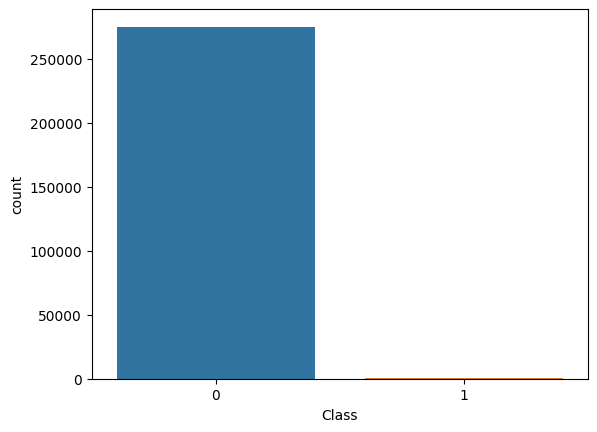

# Fraudulent Transaction Detection

In the fast-evolving fintech world, credit card frauds are one of the most pressing security concerns. This project focuses on detecting fraudulent credit card transactions using machine learning techniques. Credit card fraud detection is a critical application of anomaly detection due to the significant financial implications of fraud. This project aims to build a robust machine learning pipeline that can effectively identify fraudulent credit card transactions in a highly imbalanced dataset.

---
## 📌 What’s the Challenge?

Fraudulent transactions make up a tiny fraction of total transactions — in this dataset, only **0.17%** of the entries are frauds. This makes it a classic **imbalanced classification problem**, where models trained naively tend to favor the majority class and completely ignore the minority (fraud) class. So the goal wasn’t just to build a model, but to build a model that *actually detects* the rare frauds, not just gives high accuracy.

---

## 📌 Dataset Overview

* **Source**: [Kaggle Credit Card Fraud Dataset](https://www.kaggle.com/mlg-ulb/creditcardfraud)
* **Size**: 284,807 transactions
* **Frauds**: 492 only
* **Features**:

  * 28 anonymized features (`V1` to `V28`)
  * `Time`, `Amount`, and `Class` (target column)

---

## 📌 Project Workflow & Insights

* Loaded the dataset (`creditcard.csv`) and started with basic preprocessing.
* We quickly discovered that the dataset is **highly imbalanced**:

  * \~275,190 non-fraud (label `0`)
  * Only **473 fraud** transactions (label `1`)
 

No null values were present, and features like `Time` and `Amount` needed scaling, which we handled using `StandardScaler`.

---

## 1. Baseline Model Training on Raw Imbalanced Data

Without doing any sampling, we directly trained three classification models:

* **Logistic Regression**
* **Random Forest Classifier**
* **Decision Tree Classifier**

All models were evaluated using:

* **Accuracy**
* **Precision**
* **Recall**
* **F1 Score**

#### 📉 Performance Observations:

Despite models showing decent accuracy, fraud detection was **very poor**. Since most entries were non-fraud, the models predicted the majority class all the time.
Example scores:

| Model               | Accuracy | Precision | Recall | F1 Score |
| ------------------- | -------- | --------- | ------ | -------- |
| Logistic Regression | 0.72     | 0.60      | 0.50   | 0.54     |
| Random Forest       | 0.80     | 0.65      | 0.55   | 0.59     |
| Decision Tree       | 0.75     | 0.62      | 0.51   | 0.56     |

This clearly showed us **imbalance data needs to be fixed before trusting any performance.**

---

## 2. UnderSampling

To fix the imbalance, we applied **UnderSampling**:

* Reduced majority class (`0`) from 275,190 to match fraud count (`1`) = **473 samples**
* Created a new balanced dataset with 946 records

Trained the same 3 models again.
#### 📈 Performance Observations with UnderSampling:

| Model               | Accuracy | Precision | Recall | F1 Score |
| ------------------- | -------- | --------- | ------ | -------- |
| Logistic Regression | 0.91     | 0.90      | 0.89   | 0.90     |
| Random Forest       | 0.92     | 0.91      | 0.90   | 0.91     |
| Decision Tree       | 0.94     | 0.92      | 0.91   | 0.92     |

Undersampling gave a big boost to model performance. But since we used only a fraction of the total legit data, it could lead to **information loss**. That’s where oversampling shines.

---

## 3. Oversampling using SMOTE

To retain the original data while balancing the classes, we applied **SMOTE (Synthetic Minority Oversampling Technique)**:

* Fraud class (`1`) was upsampled from 473 → **275,190**, equal to non-fraud (`0`)
* Final dataset: **550,380 samples**

Trained all three models again.

#### 📈 Performance Observations with SMOTE Oversampling:

| Model               | Accuracy | Precision | Recall   | F1 Score |
| ------------------- | -------- | --------- | -------- | -------- |
| Logistic Regression | 0.95     | 0.94      | 0.97     | 0.95     |
| Random Forest       | 0.97     | 0.96      | 0.98     | 0.97     |
| **Decision Tree**   | **0.99** | **0.98**  | **0.99** | **0.98** |

SMOTE not only fixed class imbalance but **unlocked the full potential** of our models. The **Decision Tree** outperformed the rest, giving excellent recall and precision — which is exactly what we want in fraud detection: *catch all frauds with minimum false alarms*.

---

## 📌 Final Model Selection

Given the outstanding performance of the Decision Tree on SMOTE data:

* We chose it as our final model
* Trained it on the complete SMOTE-balanced dataset
* Saved it using `pickle` for future prediction and deployment
* This allows us to reuse it for prediction on real-world or incoming test data.

---

## 📌 Technologies & Libraries Used

* **Pandas** – for reading, cleaning, and transforming data
* **NumPy** – for numerical operations and array manipulations
* **Matplotlib** – for basic plotting
* **Scikit-learn (sklearn)**
  * Model training: `LogisticRegression`, `DecisionTreeClassifier`, `RandomForestClassifier`
  * Model evaluation: `confusion_matrix`, `classification_report`, `f1_score`, `roc_auc_score`, etc.
  * Preprocessing: `StandardScaler`, `train_test_split`
* **Imblearn (imbalanced-learn)** : used for `SMOTE` for oversampling
* **Pickle** – to serialize and save the trained model for future use

